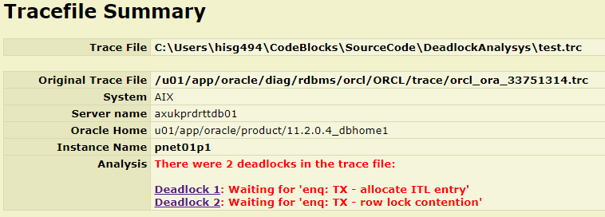

= Deadlock Analysis
:author: Norman Dunbar
:email: norman@dunbar-it.co.uk
:version: 0.1.1
:date: 2017-2019
:doctype: book
:media: prepress
:toc: left
:tocdepth: 5
:icons: font
:sectnums:
:source-highlighter: coderay

== Introduction
The purpose of the Deadlock Analysis tool is to read one or more trace files, created either by an ORA-00060 error or an event 10046 (or equivalent), and to extract details and potential reasons for any deadlocks that it finds in the file.

A report is created, in HTML format, for each trace file passed as a command line argument. The report is created in the same path as that of the trace file, and is named exactly as per the input trace file, but with `.html` as the file's extension as opposed to `.trc`.

== Execution
if the directory that the executable lives in is on your path, then:

[source]
----
DeadlockAnalysis list_of_trace_file_names
----

Otherwise you can:

[source]
----
cd place/where/executable/lives
./DeadlockAnalysis list_of_trace_file_names
----

or:

[source]
----
full/path/to/DeadlockAnalysis list_of_trace_file_names
----

The report(s) will be created in the location of the trace files. One report for each trace file.

== How it Works
The trace file is read and searched for any deadlocks. There may be more than one found. For each one found, the deadlock graph is extracted along with the objects etc waited upon by the waiting sessions.

The signature of the deadlock is then extracted from the graph. This is used to provide potential reasons for the deadlock. At present the utility lists the following:

[cols="20%,80%"]
|===

| *Signature*
| *Reason(s)*

| UL
| User defined  locking has caused the problem. Things like `select for update`, `lock table`, `dbms_lock`, etc. You are pretty much on your own in sorting that out I'm afraid!

.2+| TX-X-X
| Typical application code fault. Resources usually locked in different orders.
| Self deadlock with or without autonomous transactions.

.4+| TX-X-S
| ITL shortage in the affected data blocks.
| Bitmap Indexes in use.
| Primary key - multiple identical `INSERTS` or `UPDATE`.
| Unique key - multiple identical `INSERTS` or `UPDATE`.

| TM-SX-SSX-SX-SSX
| Unindexed foreign key column(s) on child table(s).

|===

The objects involved in the deadlock are extracted from the "waited on resource" section of the trace and listed on the report.

The report will _attempt_ to diagnose the reason for the deadlock based on the trace's 'process state' and the full wait stack, extracted from that section, will also be reported, and is used to limit the number of possible reasons for the deadlock. For example, if  the current wait state is `waiting for 'enq: TX - allocate ITL entry'` then there's no point advising that it _could_ be bitmap indexes etc.

== Reports
Each report is made up of a number of sections.

=== Contents
The contents is displayed at  the top left of the report, when opened in a browser, and has links to the trace file summary details, and to each deadlock found within the trace file.

 
=== Trace File Summary

The trace file summary is displayed at the start of the report. It simply shows a few details from the original trace file and the number of deadlocks that it found.

=== Deadlock Summary

Each deadlock has its own sections in the report. There is a summary, the graph and details of the waiting sessions for each deadlock.

The deadlock summary lists overall details of the particular deadlock itself. Here you will find:

* The line number in the trace file where the deadlock dump starts;
* The number of sessions involved in this particular deadlock;
* The SID of the session that was dumped out after having it's SQL statement rolled back (not the transaction though, just the statement);
* The reason for the deadlock;
* The wait stack for the dumped session;
* The deadlock signature - as per the various Oracle documents on the matter of diagnosing deadlock reasons;
* A probable cause for the deadlock;
* The SQL statement that was rolled back because of the deadlock.

=== Deadlock Graph

This section is just a duplication, pretty much, of the deadlock graph in the trace file.

=== Deadlock Waiters

This sections lists the waiting sessions, and details of the resources they are waiting on at the time of the deadlock.

=== Exit Codes
In the event of an error while executing, the following exit codes are returned:

* 0: Everything worked.
* 1: Not enough parameters supplied. There must be at least one trace file name passed.
* 2: The trace file cannot be opened.
* 3: There was an error reading the trace file.
* 4: There was a problem creating the report file for the trace.
